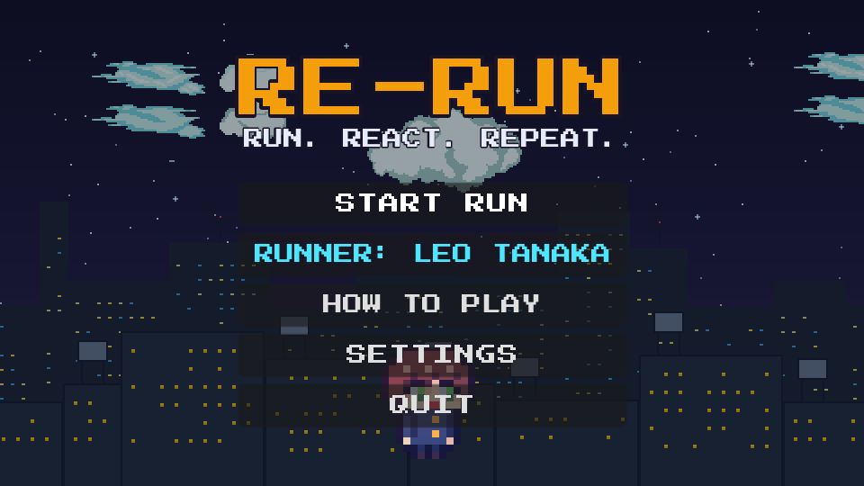
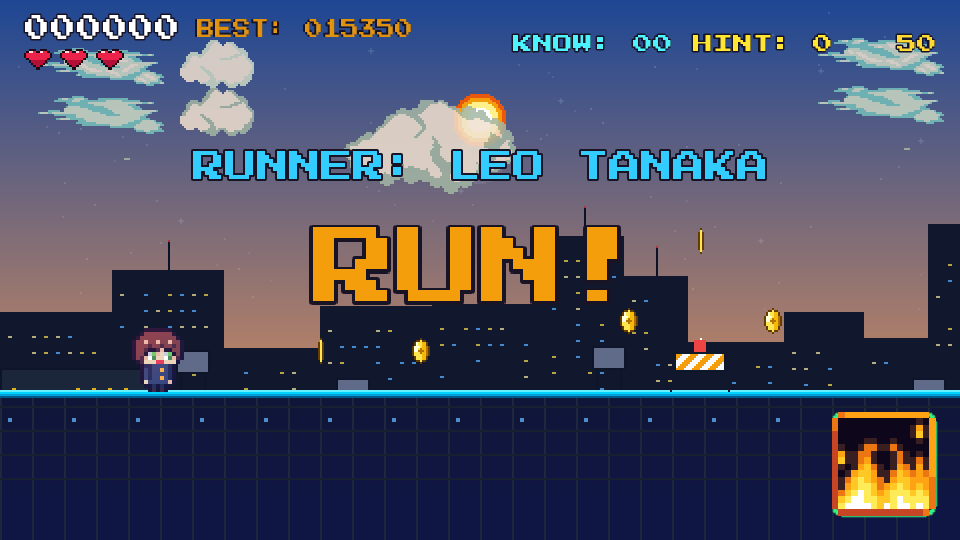
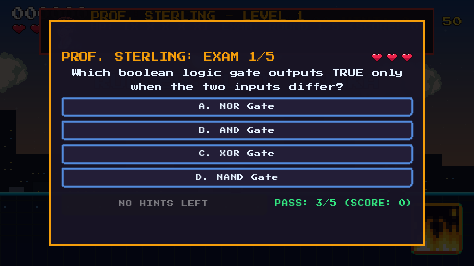
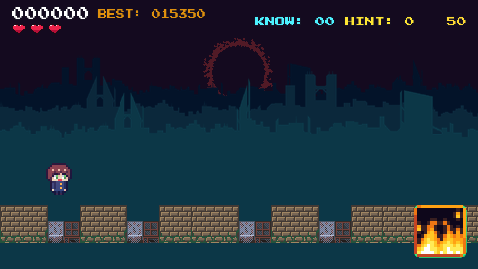

# RE-RUN 🎓🏃‍♂️

> **RUN. REACT. REPEAT.**  
> *A high-octane pixel-art college endless-runner and computer science platformer built in Godot Engine 4.3.*

<p align="center">
  
  
</p>
<p align="center">
  
  
</p>

---

## 🎮 Overview

**RE-RUN** puts you in the shoes of a college engineering student racing across a procedural campus and cyber cityscape. To survive and advance towards graduation, you must leap over traffic barriers, slide under steam pipes, dodge bottomless pits, slash through robotic drones, collect knowledge shards, and survive the dreaded **Janitor** in hot pursuit!

At the end of each level lies the **Department Final Exam**: a confrontation with the course professor where you must answer technical computer science questions to pass and unlock the next semester.

---

## 🕹️ Controls & Core Actions

| Action | Primary Key | Secondary / Alternative |
| :--- | :--- | :--- |
| **Run / Move** | `A` / `D` | `Left` / `Right Arrow` |
| **Jump** (Double Jump supported) | `Space` | `W` / `Up Arrow` |
| **Slide** (Duck under pipes) | `S` | `Down Arrow` |
| **Slash / Melee Attack** | `J` / `F` / `Z` | `Left Mouse Click` |
| **Activate Character Perk Skill** | `E` / `K` | Click Skill Button (Bottom Right) |
| **Pause Game** | `P` | `Escape` |
| **Quick Restart** | `R` | Menu button |

---

## 🏛️ The 10 Campaign Levels & Faculty Bosses

Each level represents an academic year and subject discipline. To defeat the professor and unlock the next level, you must answer **at least 3 out of 5 questions correctly (60% pass mark)**.

```
 LEVEL 1 ──► LEVEL 2 ──► LEVEL 3 ──► LEVEL 4 ──► LEVEL 5 (SECRET RIFT!)
    │                                                    │
    ▼                                                    ▼
 LEVEL 6 ──► LEVEL 7 ──► LEVEL 8 ──► LEVEL 9 ──► LEVEL 10 (GRADUATION)
```

| Level | Subject & Curriculum | Professor / Boss | Pass Condition | Signature Mechanics & Biome |
| :---: | :--- | :--- | :---: | :--- |
| **1** | **Computer Systems & Core Data Structures** | **Prof. Sterling** | 3/5 Correct | Balanced campus sprint, traffic barriers, overhead pipes, janitor patrol. |
| **2** | **Computer Networks & Cyber Infrastructure** | **Dr. Evelyn Vance** | 3/5 Correct | Higher sprint velocity, flying eye drones, network data packets, dusk sky. |
| **3** | **Database Architecture & Cloud Scaling** | **Prof. Marcus Thorne** | 3/5 Correct | Fast obstacle chains, B+ Tree indexing shards, cloud platform leaps. |
| **4** | **Artificial Intelligence & Neural Networks** | **Dr. Samantha Hayes** | 3/5 Correct | Floating platforms, gradient vector pickups, backprop exam questions. |
| **5** | **Operating Systems & Compiler Design** | **Prof. Vikram Patel** | 3/5 Correct | Kernel lab runway, MMU page translation hazards. **[SECRET EASTER EGG]** |
| **6** | **Distributed Systems & Microservices** | **Dr. Beatrice Dupont** | 3/5 Correct | Cluster server blocks, consensus broker nodes, high-speed leaps. |
| **7** | **Computer Graphics & GPU Shaders** | **Prof. Kenji Takahashi** | 3/5 Correct | Neon shader cityscape, ray-traced lighting atmosphere, fast hurdles. |
| **8** | **Embedded Robotics & Microcontrollers** | **Dr. Sofia Rodriguez** | 3/5 Correct | Robotics hangar, servo drone hazards, PWM voltage leap pacing. |
| **9** | **Advanced Cryptography & Quantum Computing** | **Prof. Alexander Wright** | 3/5 Correct | Qubit superposition platforms, quantum gate barriers, high speed. |
| **10** | **Grand Capstone Finals & Graduation Day** | **Principal Arthur Pendelton** | 3/5 Correct | The ultimate capstone exam combining questions across all 10 disciplines! |

---

## 🎓 Department Final Exam

<p align="center">
  
</p>

- At the end of every level runway, the professor challenges you to a 5-round examination.
- **Pass Requirement**: Score 3 out of 5 correct answers to defeat the professor, advance to the next level, and save your progress.
- **Hints (50:50)**: Use earned hints to eliminate two incorrect choices.
- **Fair Re-Exam System**: If you fail an exam or run out of hearts, you can spend **50 Wallet Coins** to revive. You are safely repositioned **$360\text{px}$ back on the runway** (over $500\text{px}$ away from the professor) with full hearts, and the exam engine **filters out previously asked questions to deliver completely new questions**!

---

## 🔮 The Secret Level 5 Easter Egg: "The Shadow District"

<p align="center">
  
</p>

> *"Wait... reality is tearing?!"* — The Janitor

On **Level 5 (Prof. Patel's OS & Compiler Lab)**, a hidden dimensional rift anomaly is active:

1. **How to Trigger**:
   - Play **Level 5**.
   - When the Janitor appears and starts chasing you, **do NOT jump over or escape him**.
   - Let the Janitor collide with and catch you!
2. **The Anomaly**:
   - Instead of giving you Detention or triggering a Level Failed screen, reality tears open with a chromatic screen glitch!
   - The Janitor is stunned as a dimensional vortex sucks you into the **Alternate Realm ("The Shadow District")**!
3. **The Alternate Realm Gauntlet**:
   - **Blood Eclipse Sky**: A glowing red celestial ring and dark skyline replace the campus.
   - **Monster Formations**: Marching hordes of armored Zombies (4-unit phalanxes), charging Skeletons, and floating sky Witches.
   - **Escape Objective**: Run $2600\text{px}$ across apocalypse ramparts and leap into the **Dimensional Rift** to warp back!
   - *Quick Shortcut*: You can also launch this secret mode directly via `PLAY_SECRET_ALTERNATE_REALM.bat`.

---

## 👥 Student Roster & Unique Perks

<p align="center">
  
</p>

Choose your runner from the campus roster on the Main Menu:

- ⚡ **Leo Tanaka** (*Algorithms*): **+10% Passive Sprint Speed** across all tracks.
- 🛡️ **Kai Sterling** (*Cybersecurity*): Starts every run with an active **Energy Shield Generator** that absorbs 1 hazard hit.
- 🦘 **Ren Takahashi** (*Physics*): Equipped with low-gravity boots for **extended hang-time and higher double jumps**.
- 💡 **Sayaka Endo** (*Database*): Memory savant who starts every level with **2 Free 50:50 Exam Hints**.
- ❤️ **Erika Von Braun** (*Cybernetics*): Upgraded cybernetic chassis featuring **4 Lifeline Hearts** (instead of 3) and emergency Nanite Repair.
- 🌟 **Maya Lin** (*Software Architecture*): Balanced agility with quick-recovery slide frames.

---

## 💡 Technical Quiz & Pickups

- **Knowledge Crystals (`+50 KNOW`)**: Boost academic knowledge used to purchase emergency hints.
- **Memory Shards**: Contain actual test questions that appear during the level. Finding them guarantees those questions appear on the professor's exam!
- **50:50 Lifeline Hint Button**: During any quiz or boss exam, spend a hint to strike out 2 wrong answers automatically.

---

## 🚀 How to Run & Play

### Requirements
- **Godot Engine 4.3** (Windows, Linux, or macOS)
- A display supporting the **480 × 270** retro pixel-art canvas viewport (scaled cleanly via integer canvas scaling).

### One-Click Launchers (Windows)
The repository includes automated batch launchers:

- `PLAY_GAME.bat` — Launches the complete game from the Main Menu.
- `SELECT_LEVEL.bat` — Interactive terminal menu to select and launch any Level from 1 to 10 or the Alternate Realm.
- `PLAY_LEVEL_1.bat` through `PLAY_LEVEL_10.bat` — Direct-launch scripts for specific levels.
- `PLAY_SECRET_ALTERNATE_REALM.bat` — Direct launcher into the secret apocalyptic realm.

### Running from Godot Editor
1. Open the Godot Project Manager and import `RE-RUN/RE-RUN/project.godot`.
2. Press **F5** (or click **Play Project**).
3. The main entrance scene is `res://Scenes/UI/main_menu.tscn`.

---

## 📁 Repository Structure

```
CollegeRun/
├── screenshots/                    # Visual gameplay screenshots & exam previews
├── PLAY_GAME.bat                   # Master game launcher
├── SELECT_LEVEL.bat                # Interactive level selector
├── PLAY_LEVEL_1.bat - 10.bat       # Direct level launchers
├── PLAY_SECRET_ALTERNATE_REALM.bat # Secret mode launcher
├── RE-RUN_GAME_BUILD_DOCUMENTATION.pdf # Game architecture document
└── RE-RUN/RE-RUN/                  # Godot 4.3 Engine Project Root
    ├── project.godot               # Project configuration & autoloads
    ├── Scenes/
    │   ├── Levels/                 # level_1.tscn, alternate_realm.tscn
    │   ├── Objects/                # GroundBlock, janitor_chase, monster_*, etc.
    │   ├── Player/                 # player.tscn
    │   └── UI/                     # main_menu.tscn, hud.tscn
    ├── Scripts/
    │   ├── Autoload/               # game_settings.gd (global state & curriculum)
    │   ├── Levels/                 # level_1.gd, alternate_realm.gd
    │   ├── Objects/                # janitor_chase.gd, monster_enemy.gd, etc.
    │   ├── Player/                 # player.gd
    │   └── UI/                     # hud.gd, main_menu.gd
    └── Assets/                     # 16x16 pixel sprites, audio, UI, fonts
```

---

## 📜 Credits & License

- **Game Engine**: Godot Engine 4.3 Stable
- **Design & Programming**: Antigravity Pair-Programming Suite & Stewin Navin Mathias
- **Typography**: Press Start 2P & ArcadeClassic retro pixel fonts
- **Audio & SFX**: Retro 8-bit synthesizer waveforms & chiptunes
